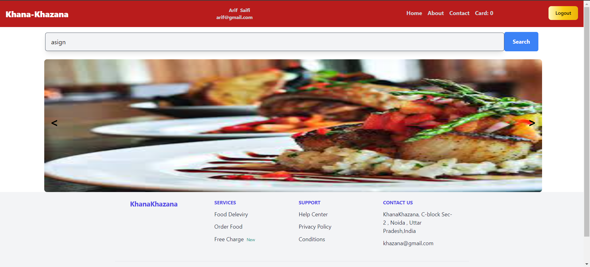

## About Khana

This is a Khana Food app in React and app Feature is User can i Register himself and view a in table and update a user Profile Crud add Name , Image , Email , Gender , List of Courser ,Choose a Password and Confirm it and User enter a password user can visible a password just click see password buttons Can See a Full List of Item in Food add to card Feature. 

- [User can Create Profile]
- [List if Food Item]
-  Corusel Feature [food]
- Database [MongoDB]
- [Backend Nodejs]

ReactJs is accessible, powerful, and provides tools required for large, robust applications.

## Learning React

React has the most extensive and thorough [documentation] and video tutorial library of all modern web application frameworks, making it a breeze to get started with the framework.

